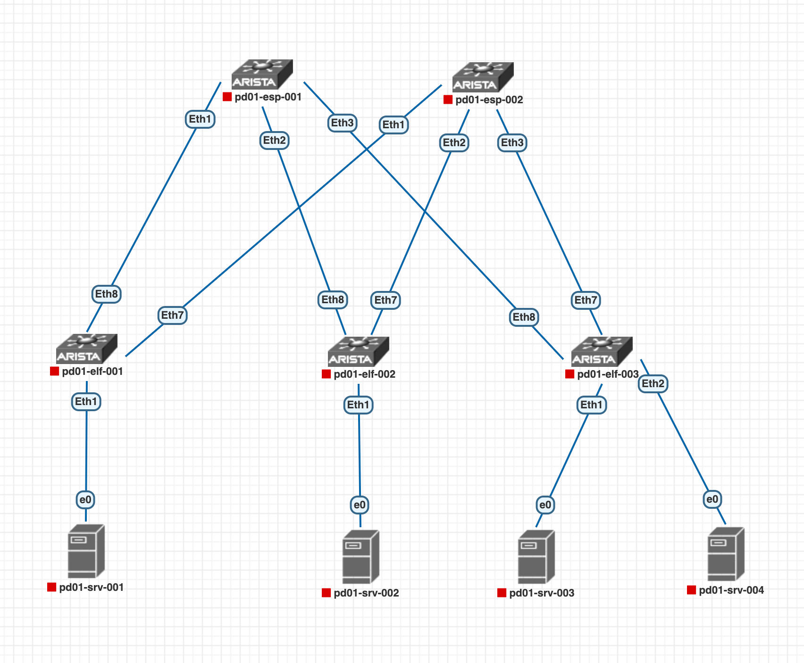

# Проектирование сети и адресного пространства ЦОД

---

В данной работы мы спроектируем сеть одного из подов(PD01) нашего ЦОД а так же распределим пространство IP адресов, которое будет использоваться для p2p линков, loopback интерфейсов сетевых устройств и серверов, которые подключены к leaf.

## Топология сети CLOS нашего POD

## Распределение IP адресов

### Interconnect links

p2p адресация может пересекаться в разных ЦОД, поэтому для нее будем использовать /31 сети из следующего префикса:

- 169.254.0.0/16

### Loopbacks network

Для loopback интерфейсов сетевых устройств будем использовать сеть

- _10.\[a\].\[b\].0/24_, где:

1.  \[a\] - номер POD(варианты значений от 1 до 255)
2.  \[b\] - принадлежность устройства к контуру spine / leaf (spine - 1, leaf - 2-4, значения 5-9 зарезервированы, 10+ - сервера)

Таким образом получаем следующие IP адреса для наших Loopback интерфейсов

<table><tbody><tr><td>pd01-esp-001&nbsp;</td><td>10.1.1.1/32</td></tr><tr><td>pd01-esp-002&nbsp;</td><td>10.1.1.2/32</td></tr><tr><td>pd01-elf-001</td><td>10.1.2.1/32</td></tr><tr><td>pd01-elf-002&nbsp;</td><td>10.1.2.2/32</td></tr><tr><td>pd01-elf-003</td><td>10.1.2.3/32</td></tr></tbody></table>

### Servers network

Для терминации серверов будем исползовать сеть:

- _10.\[a\].\[b\].0/24_, где:

1.  \[a\] - номер POD(варианты значений от 1 до 255)
2.  \[b\] - принадлежность устройства к контуру spine / leaf (spine - 1, leaf - 2-4, значения 5-9 зарезервированы, 10+ - сервера)

Таким образом получаем следующие IP адреса для наших серверов

<table><tbody><tr><td>pd01-srv-001</td><td>10.1.10.1/24</td></tr><tr><td>pd01-srv-002</td><td>10.1.20.1/24</td></tr><tr><td>pd01-srv-003</td><td>10.1.30.1/24</td></tr><tr><td>pd01-srv-004</td><td>10.1.30.2/24</td></tr></tbody></table>
