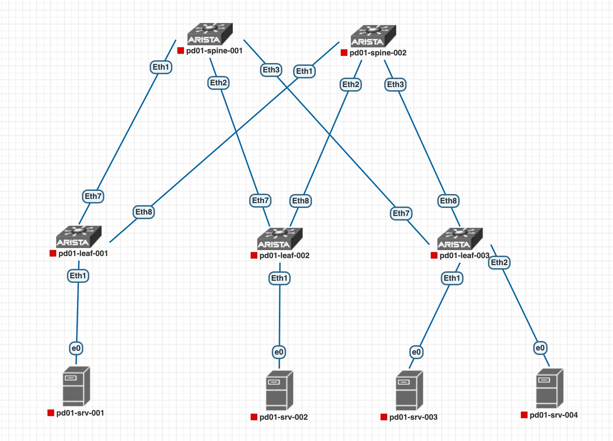
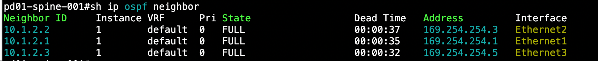
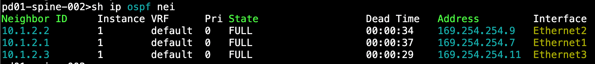
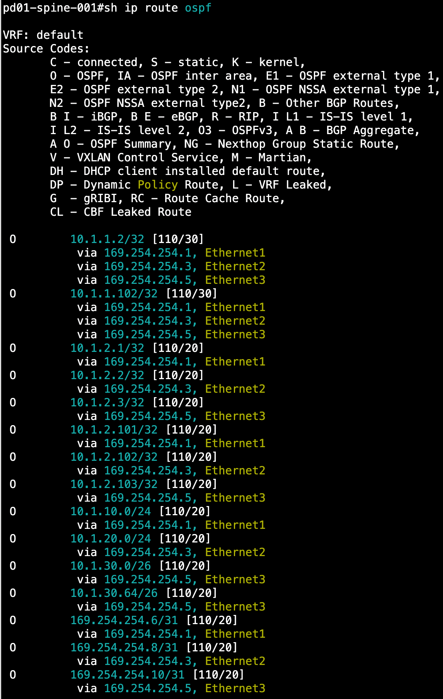
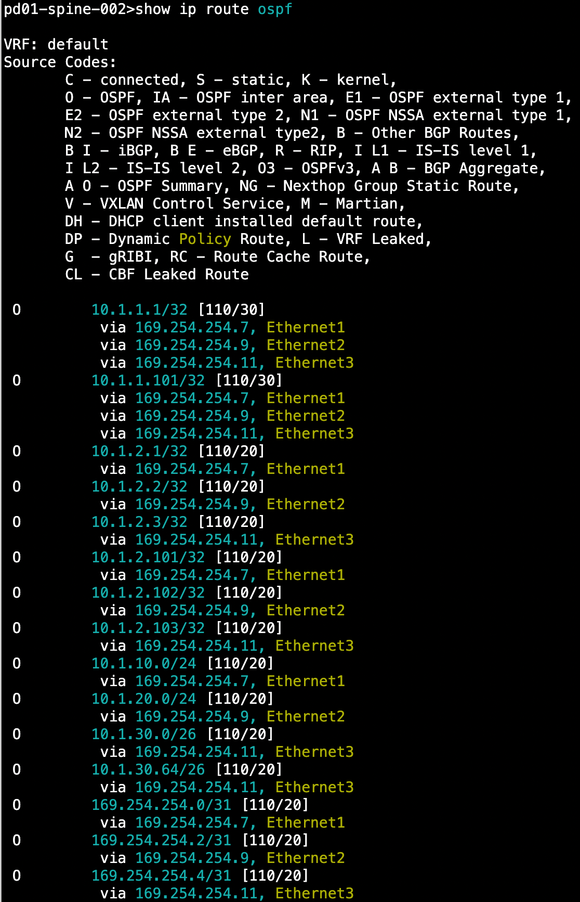
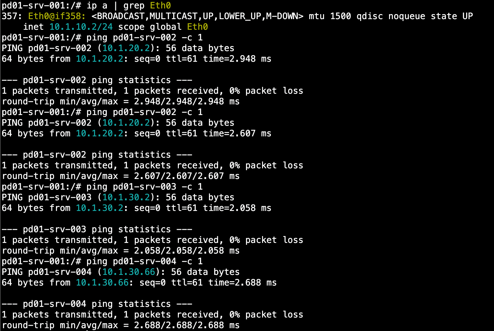
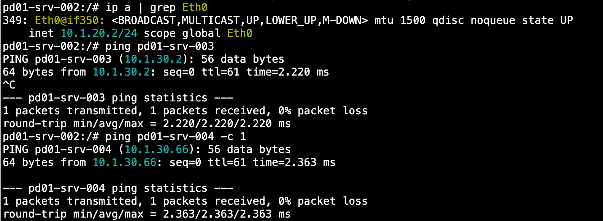
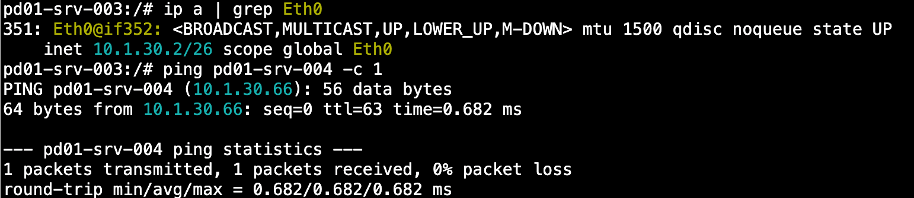
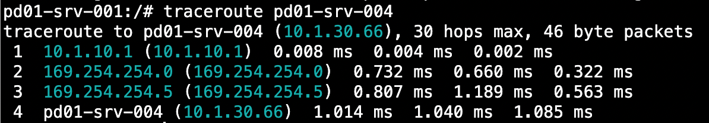

# Построение Underlay сети(OSPF)

#### В данной работе мы соберем сеть в топологии CLOS, а так же настроим в ней динамическую маршрутизацию с помощью протокола OSPF

## План работы

1.  Настроим на коммутаторах P2P, loopback интерфейсы, а так же интерфейсы для терминации серверов согласно [Проекта адресации](https://github.com/aledkrv/otus_cod_learning/tree/main/lesson_1)
2.  Настроим протокол динамической маршрутизации OSPF

---

## Конфигурирование устройств

### Настройка IP адресов

Мы имеем следующую топологию:



В конфигурации будет использовано 2 Loopback интерфейса на каждом коммутаторе, т. к. best practice является использовать разные loopback адреса для underlay(маршрутизация) и overlay(напр. VXLAN) сервисов.

* Адрес Loopback0 будет использоваться для underlay сервисов
* Адрес Loopback1 будет использоваться для underlay сервисов

Адрес Loopback1 определяется как последний байт Loopback0 адреса +100

Конфигурация интерфейсов leaf коммутаторов. Ниже приведен пример настройки интерфейсов pd01-leaf-001. Другие leaf настраиваются аналогично, отличаются только IP адреса на интерфейсах.

```
interface Ethernet1
   description pd01-leaf-001 -> pd01-srv-001
   no switchport
   ip address 10.1.10.1/24
interface Ethernet7
  description pd01-leaf-001 -> pd01-spine-001
  no switchport
  ip address 169.254.254.1/31
!
interface Ethernet8
  description pd01-leaf-001 -> pd01-spine-002
  no switchport
  ip address 169.254.254.7/31
!
interface Loopback0
  ip address 10.1.2.1/32
!
interface Loopback1
  ip address 10.1.2.101/32
```

Конфигурация интерфейсов spine коммутаторов. Ниже приведен пример настройки интерфейсов pd01-spine-001. Другие spine настраиваются аналогично, отличаются только IP адреса на интерфейсах.

```
interface Ethernet1
  description pd01-spine-001 -> pd01-leaf-001
  no switchport
  ip address 169.254.254.0/31
!
interface Ethernet2
  description pd01-spine-001 -> pd01-leaf-002
  no switchport
  ip address 169.254.254.2/31
!
interface Ethernet3
  description pd01-spine-001 -> pd01-leaf-003
  no switchport
  ip address 169.254.254.4/31
!
interface Loopback0
  ip address 10.1.1.1/32
!
interface Loopback1
  ip address 10.1.1.101/32
```

### Настройка OSPF

Включаем OSPF на коммутаторах и назначаем им router-id аналогичный loopback0. Ниже приведен пример настройки OSPF на pd01-spine-001. Другие коммутаторы настраиваются аналогично, отличаются только IP адреса router-id.

```
router ospf 1
  router-id 10.1.1.1
```

Настравиаем OSPF на интерфейсах, информация о маршрутах которых должна передаваться OSPF соседям. Все линки и коммутаторы принадлежат одной зоне - Area 0. На P2P линках применяем команду ip ospf network point-to-point. При использовании данной команды во время установки соседства будет пропущен шаг выбора DR/BDR что сократит время установления соседства.

```
interface p2p
  ip ospf network point-to-point
  ip ospf area 0.0.0.0
```

```
interface LoopbackX
  ip ospf area 0.0.0.0
```

Настройка завершена.

---

## Проверка

Проверяем установление соседства на обеих Spine коммутаторах:






Проверяем маршруты, полученные по OSPF на Spine коммутаторах:
<details>
  <summary>show ip route ospf</summary>
  <br>
  <br>
</details>

Проверяем доступность между всеми серверами:
<details>
  <summary>ping results</summary>
  <br>
  <br>
  <br>
</details>
Выполним трассировку между pd01-srv-001 и pd01-srv-004



Как видно из трассировки, наш пакет сначала попал на шлюз хоста, который находится на pd01-leaf-001 Et1(10.1.10.1), далее он отправился на pd01-spine-001 Et1(169.254.254.0), затем на pd01-leaf-003(Et8) и пришел на хост pd01-srv-004.

---

Конфигурационные файлы устройств доступны в папке [lab_ospf_configs](https://github.com/aledkrv/otus_cod_learning/tree/main/lesson_2_ospf/lab_ospf_configs)
