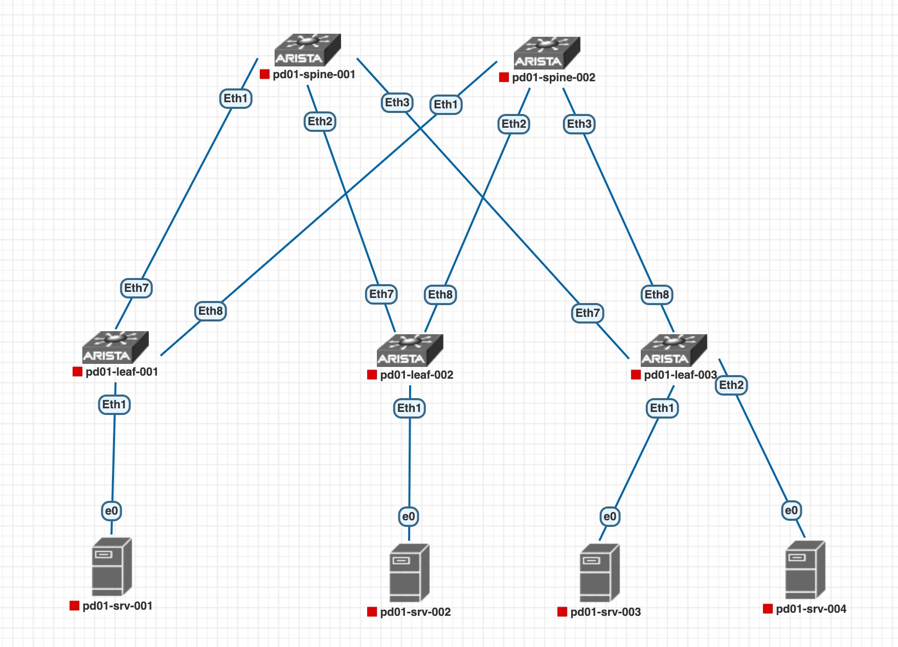
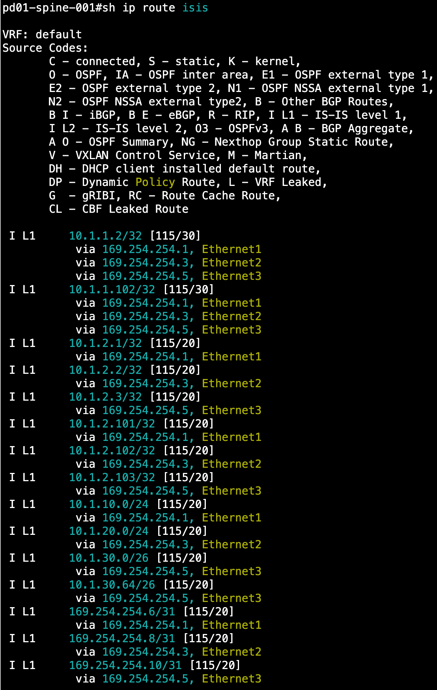
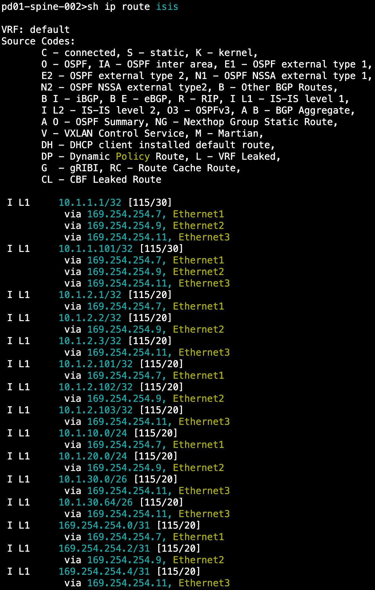
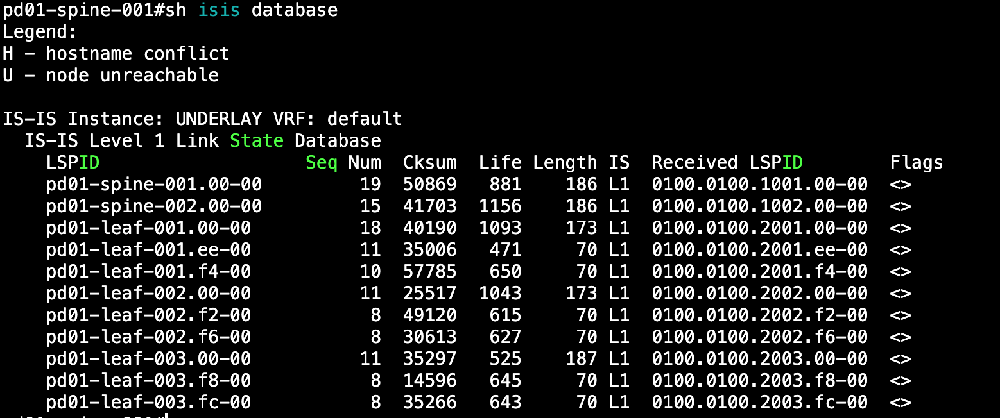
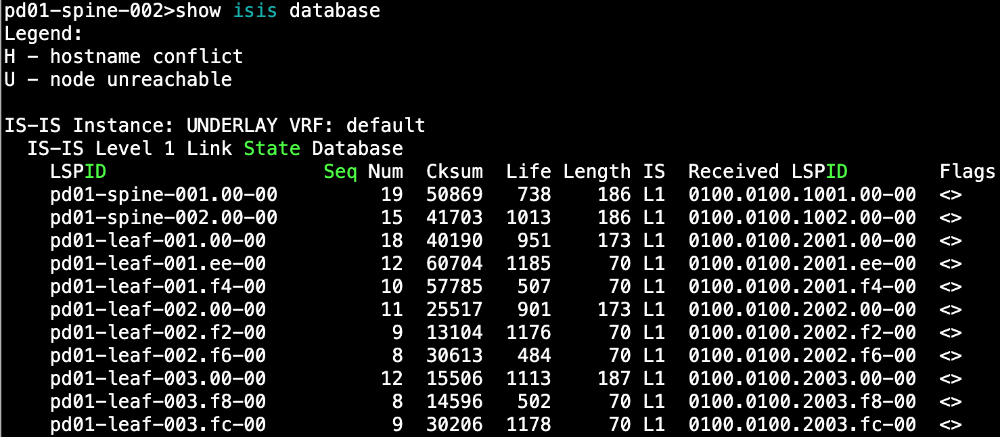
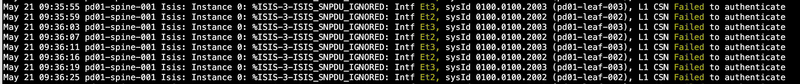
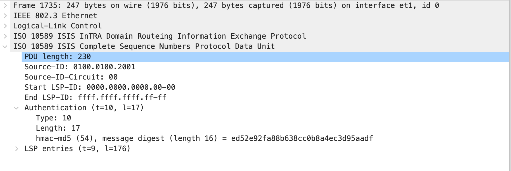
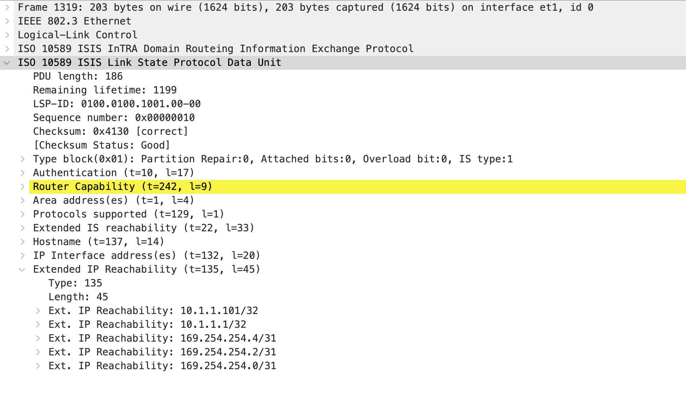
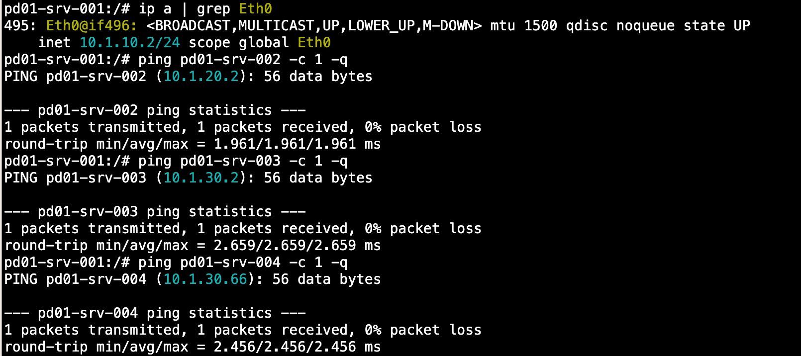
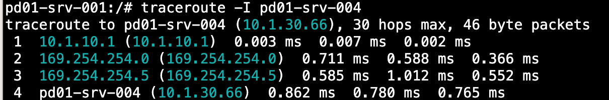

# **Построение Underlay сети(ISIS)**

#### **В данной работе мы соберем сеть в топологии CLOS, а так же настроим в ней динамическую маршрутизацию с помощью протокола ISIS**

Мы имеем следующую топологию: <br>


За основу возьмем сеть собранную в топологию CLOS на [предыдущем занятии](https://github.com/aledkrv/otus_cod_learning/tree/main/lesson_2_ospf) с настроенными p2p интерфейсами и loopback интерфейсами.

### Настройка ISIS

Включаем ISIS на коммутаторах, назначаем им:
1. NET основанный на адресе loopback0; 
2. router-id такой же как IP адрес loopback0;
3. is-type, т. к. у нас все устройства в рамках одной area - все маршрутизаторы будут иметь is-type L1
4. address-family ipv4 unicast, т. к. это обязательный параметр для запуска ISIS на Arista и у нас используется ISIS для ipv4 

NET формируется следующим образом:
* AFI (Authority and Format Identifier) – некий глобальный ID
для зоны. Для LAN ставят 49, означающий «локальный»
(аналог RFC1918);
* Area ID – непосредственно номер зоны;
* System ID – ID для роутера (аналог RID);
* Selector – ставьте 00, обозначает тип устройства Router.
  <image src=images/net-id.png>
Разберём NET используемый на pd01-spine-001 **49.0001.0100.0100.1001.00**:
* AFI = 49;
* Area ID = 0001;
* System ID = 10.1.1.1 = 010001001001 = 0100.0100.1001. Принцип формирования следующий: для первого октета IP адреса loopback0 дописываем спереди 0, так чтобы получилось 3 символа в октете (010 в нашем случае). Повторяем это действие для второго и последующих октетов(001, 001 и 001), затем получившуюся строку(010001001001) делим на 3 части точками;
* Selector = 00.

Ниже приведен пример настройки ISIS на pd01-spine-001. Другие коммутаторы настраиваются аналогично, отличаются только IP адрес router-id и System ID в NET.
```
router isis UNDERLAY
   net 49.0001.0100.0100.1001.00
   router-id ipv4 10.1.1.1
   is-type level-1
   address-family ipv4 unicast
```

Затем настраиваем ISIS на интерфейсах, сети которых должны анонсироваться 
````
interface XXX
   isis enable UNDERLAY
````
Так же настроим авторизацию MD5 для пиров в целях повышения безопасности
```
router isis UNDERLAY
   authentication mode md5
   authentication key otus
```
---
## Проверка
Проверяем установление соседства на обеих Spine коммутаторах:<br>
<image src=images/sp1-isis-nei.png alt="spine1-neighbors" width="500"/><br>
<image src=images/sp2-isis-nei.png alt="spine2-neighbors" width="500"/><br>
Проверяем маршруты, полученные по OSPF на Spine коммутаторах:
<details>
  <summary>show ip route isis</summary>
  <br>
  <br>
</details>
Проверяем ISIS Databases
<details>
  <summary>show isis database</summary>
  <br>
  <br>
</details>

Проверяем авторизацию. <br>
В процессе, когда на pd01-spine-001 и pd01-leaf-001 была настроена авторизация, в логах pd01-spine-001 видели ошибки аутентификации CSN.<br>
<br>
В дампе видим что от pd01-leaf-001 отправляются CSN c аутентификацией.<br>
<br>
Так же в дампе можно посмотреть LSP и увидеть какие сети передаются от пира.<br>
<br>

В финале проверяем связность между хостами.<br>
<br>
Как видно на скриншоте - связность от pd01-srv-001 до других srv есть.

Трассировка показывает что трафик до pd01-srv-004 идет через 
* pd01-elf-001
* pd01-spine-001
* pd01-elf-003

<br>

Конфигурационные файлы устройств доступны [по ссылке] (https://github.com/aledkrv/otus_cod_learning/tree/main/lesson_3_isis/lab_isis_configs)