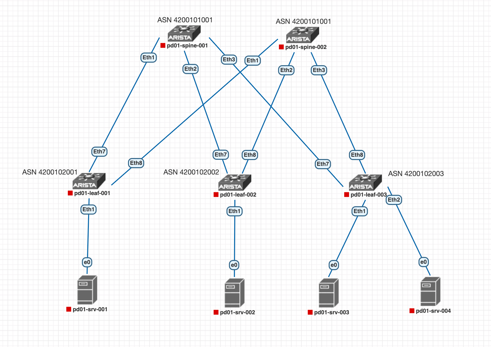
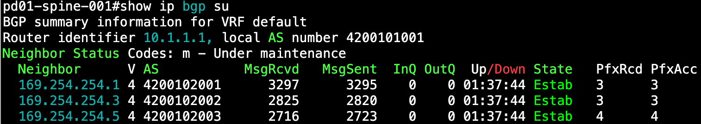
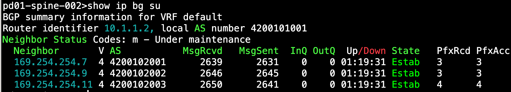
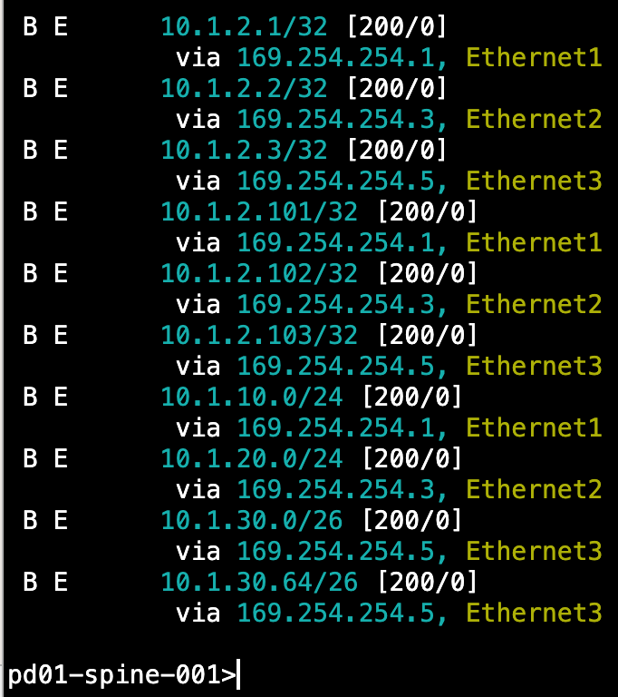
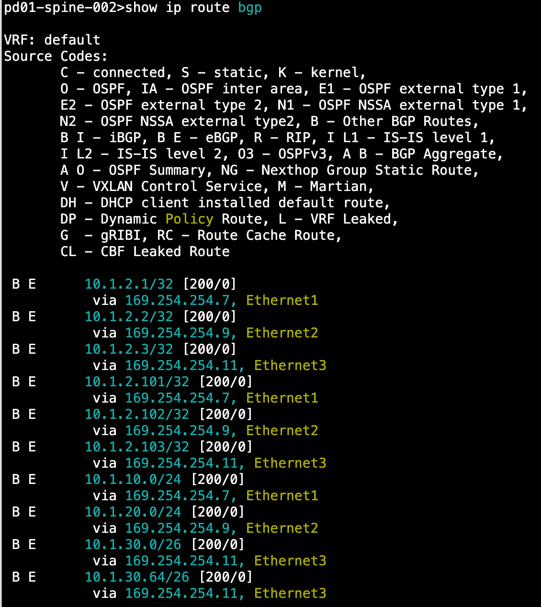
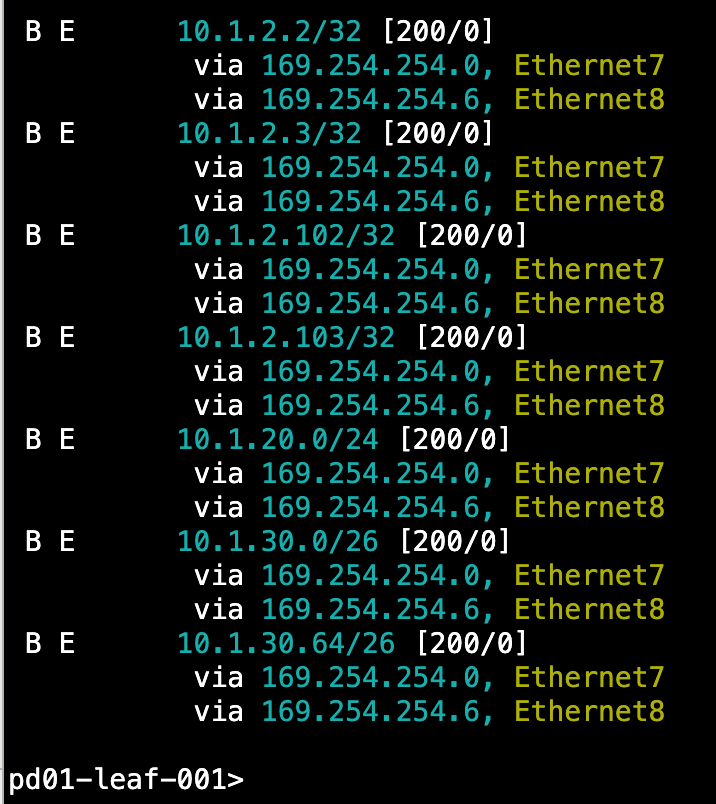
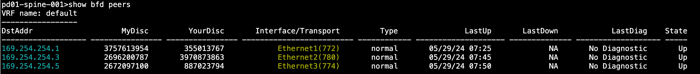
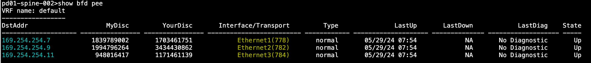
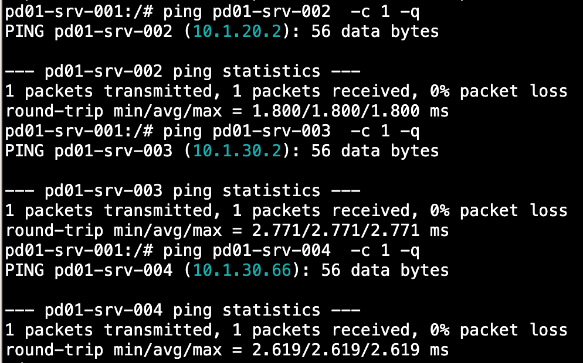

# **Построение Underlay сети(ISIS)**

#### **В данной работе мы настроим динамическую маршрутизацию в сети в топологии CLOS с помощью протокола ISIS**

Мы имеем следующую топологию:

Выбор номера автономной системы для устройства производится по следующему принципу:
* Используем 32х битные номера ASN, рекомендуемые для частного использования 4200000000 - 4294967294 [RFC6996](https://datatracker.ietf.org/doc/rfc6996/)
* Первые 3 цифры после 42 будут означать номер пода, в нашем случае 001
* Следующие 2 цифры означают тип устройства. 01 - Spine, 02 - Leaf
* Следующие 3 цифры - порядковый номер устройства.
  
Для Spine будем использовать одинаковую ASN 4200101001. <br>
Для Leaf будем использовать ASN 420010200X, где Х - номер Leaf.

### Настройка eBGP

#### Сначала настроим Leaf'ы

Приведен пример настройки pd01-leaf-001. Настройки на других Leaf аналогичные, отличаются IP адреса соседей, router-id и анонсируемые пиром сети.

Создадим prefix-list со списком сетей которые хотим анонсировать eBGP пирам:
````
ip prefix-list NET-CONNECTED
   seq 10 permit 10.1.2.1/32
   seq 20 permit 10.1.2.101/32
   seq 30 permit 10.1.10.0/24
````
Добавим созданный prefix-list в route-map. Это позволит изменять параметры передаваемых префиксов, например изменять origin для redistributed сетей.
```
route-map RM_REDIS_CONN permit 10
   match ip address prefix-list NET-CONNECTED
   set origin igp
```
Настраиваем eBGP соседства

````
router bgp 4200102001
   router-id 10.1.2.1
   maximum-paths 10 ecmp 10
   neighbor SPINES peer group
   neighbor SPINES bfd
   neighbor SPINES timers 3 9
   neighbor SPINES password 7 wMeqR2znTcw=
   neighbor 169.254.254.0 peer group SPINES
   neighbor 169.254.254.0 remote-as 4200101001
   neighbor 169.254.254.6 peer group SPINES
   neighbor 169.254.254.6 remote-as 4200101001
   redistribute connected route-map RM_REDIS_CONN

   address-family ipv4
      neighbor SPINES activate
````
В данной конфигруации мы:
   1. задаём router-id по адресу loopback0 нашего коммутатора;
   2. включаем ECMP и задаем максимальное количество возможных путей. В нашем случае с запасом на будущее - 10;
   3. Создаем peer group SPINES что позволит сократить размер конфигурации, перечислив для всех нод в группе:
  - включаем для пира в группе BFD,
  - устанавливаем таймеры keepalive и hold в 3 и 9 секунд соответственно, для уменьшения времени детектирования падения пира,
  - настраиваем пароль;
  4. прописываем соседей(spine-001 и spine-002), добавляем их в peer group SPINES и указываем для каждого remote-as
  5. включаем редистрибьюцию подключенных сетей с помощью route-map RM_REDIS_CONN
  6. в address-family ipv4 активируем соседей в группе SPINES
   
На этом настройка eBGP на Leaf завершена. <br>

#### Переходим к настройке Spine'ов

Приведен пример настройки pd01-spine-001. Настройки на других Spine аналогичные, отличаются IP адреса соседей, router-id.
````
router bgp 4200101001
   router-id 10.1.1.1
   maximum-paths 10 ecmp 10
   neighbor LEAFS peer group
   neighbor LEAFS bfd
   neighbor LEAFS timers 3 9
   neighbor LEAFS password 7 325Pwtva6k8=
   neighbor 169.254.254.1 peer group LEAFS
   neighbor 169.254.254.1 remote-as 4200102001
   neighbor 169.254.254.3 peer group LEAFS
   neighbor 169.254.254.3 remote-as 4200102002
   neighbor 169.254.254.5 peer group LEAFS
   neighbor 169.254.254.5 remote-as 4200102003
   !
   address-family ipv4
      neighbor LEAFS activate
````
Аналогично Leaf'ам задаем router-id, задаем максимальное число путей по ECMP, создаем peer group LEAFS, в которой включаем bfd, задаем таймеры и пароль. Затем прописываем соседей и включаем их в peer group LEAFS. В конце в address-family ipv4 активируем соседей в peer group LEAFS.

Настройка eBGP на Spine завершена. <br>

## Проверка

Проверяем BGP соседство Spine-Leaf на Spine коммутаторах:
<details>
  <summary>show ip bgp summary</summary>
  <br>
  <br>
</details>
<br>
Проверяем маршруты, полученные по BGP на Spine коммутаторах:
<details>
  <summary>show ip route bgp</summary>
  <br>
  <br>
</details>
<br>
Как видно из таблицы маршрутизации на pd01-leaf-001, все префиксы, полученные по BGP известны по 2м маршрутам, от spine-001 и spine-002: <br>

<br>
Проверяем установление BFD сессий между Spine и Leaf
<details>
  <summary>show bfd peers</summary>
  <br>
  <br>
</details>

Проверяем доступность srv между собой
<details>
  <summary>Ping result</summary>
  <br>
</details>

Как видим, связность между хостами, подключенными к разным Leaf есть.

Попробуем сымитировать аварию на линке, через который проходит трафик от pd01-srv-001 к pd01-srv-004.

Как видим в трассировке, пакеты идут через pd01-spine-002 и далее на pd01-leaf-003
 ````
pd01-srv-001:/# traceroute pd01-srv-004
traceroute to pd01-srv-004 (10.1.30.66), 30 hops max, 46 byte packets
 1  10.1.10.1 (10.1.10.1)  0.048 ms  0.004 ms  0.017 ms
 2  169.254.254.6 (169.254.254.6)  0.851 ms  0.809 ms  0.485 ms
 3  169.254.254.11 (169.254.254.11)  1.076 ms  1.603 ms  1.119 ms
 4  pd01-srv-004 (10.1.30.66)  0.965 ms  1.120 ms  0.860 ms
````
Запустим пинг pd01-srv-001 -> pd01-srv-004 с интервалом 0.2 секунды, а затем разорвем линк pd01-leaf-001(Et8) - pd01-spine-002(Et1).

```
pd01-srv-001:/# ping pd01-srv-004 -i 0.2
PING pd01-srv-004 (10.1.30.66): 56 data bytes
64 bytes from 10.1.30.66: seq=0 ttl=61 time=2.216 ms
64 bytes from 10.1.30.66: seq=1 ttl=61 time=2.360 ms
64 bytes from 10.1.30.66: seq=2 ttl=61 time=1.995 ms
64 bytes from 10.1.30.66: seq=3 ttl=61 time=1.905 ms
64 bytes from 10.1.30.66: seq=4 ttl=61 time=2.306 ms
64 bytes from 10.1.30.66: seq=5 ttl=61 time=2.331 ms
64 bytes from 10.1.30.66: seq=6 ttl=61 time=2.167 ms
64 bytes from 10.1.30.66: seq=7 ttl=61 time=2.254 ms
64 bytes from 10.1.30.66: seq=8 ttl=61 time=2.266 ms
64 bytes from 10.1.30.66: seq=9 ttl=61 time=2.161 ms
64 bytes from 10.1.30.66: seq=10 ttl=61 time=2.229 ms
64 bytes from 10.1.30.66: seq=11 ttl=61 time=4.078 ms
64 bytes from 10.1.30.66: seq=12 ttl=61 time=1.916 ms
64 bytes from 10.1.30.66: seq=13 ttl=61 time=1.766 ms
64 bytes from 10.1.30.66: seq=14 ttl=61 time=1.733 ms
64 bytes from 10.1.30.66: seq=15 ttl=61 time=2.051 ms
64 bytes from 10.1.30.66: seq=16 ttl=61 time=1.504 ms
```
Как видим, ICMP пакет c sequence number 11 попал в момент перестроения маршрута, поэтому время отклика увеличено. Что примечательно, ни один пакет не потерялся.

После обрыва линка трассировка имеет следующий вид:
```
pd01-srv-001:/# traceroute pd01-srv-004
traceroute to pd01-srv-004 (10.1.30.66), 30 hops max, 46 byte packets
 1  10.1.10.1 (10.1.10.1)  0.004 ms  0.004 ms  0.002 ms
 2  169.254.254.0 (169.254.254.0)  0.676 ms  0.705 ms  0.368 ms
 3  169.254.254.5 (169.254.254.5)  0.854 ms  1.132 ms  0.609 ms
 4  pd01-srv-004 (10.1.30.66)  1.031 ms  0.932 ms  0.994 ms
````
Трафик пошел через pd01-spine-001 и далее на pd01-leaf-003.

Проверка выполнена.

Конфигурационные файлы устройств доступны [по ссылке](https://github.com/aledkrv/otus_cod_learning/tree/main/lesson_3_ebgp/lab_ebgp_configs)
