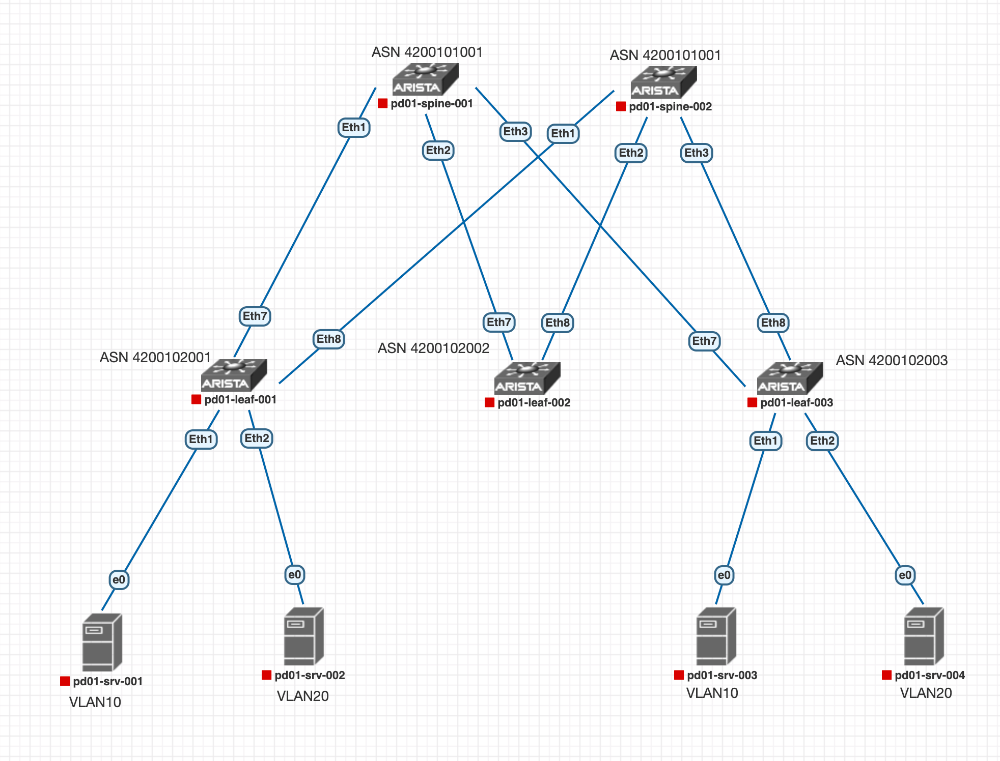
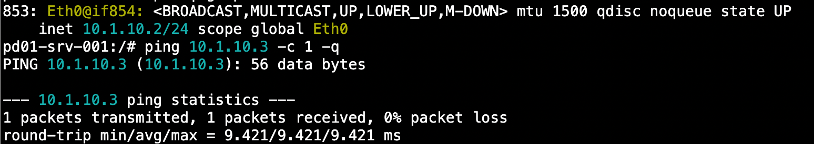
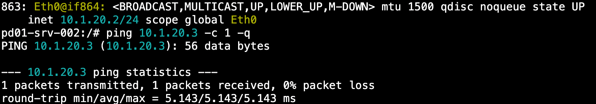
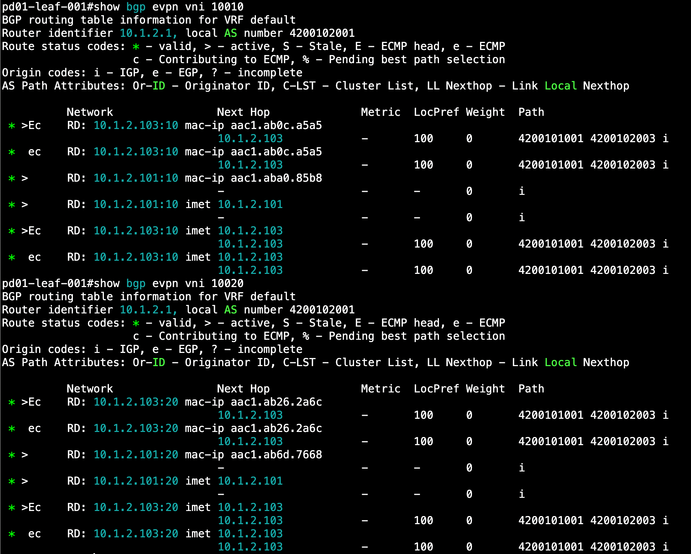
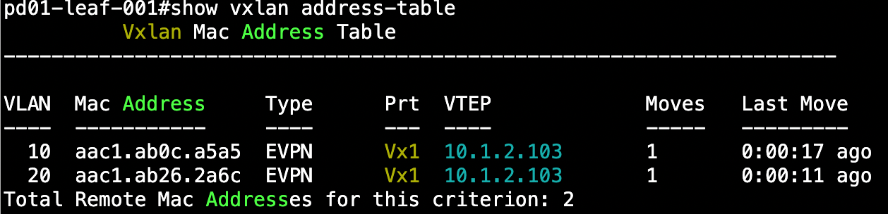
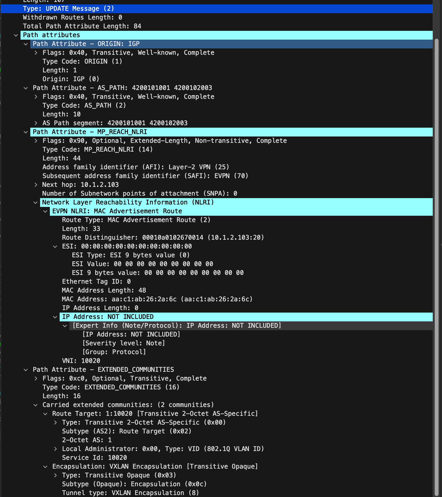
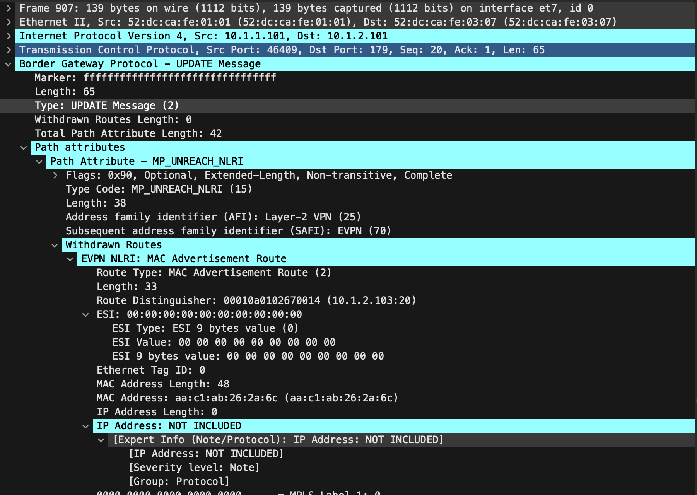

# Настройка EVPN L2

#### **В данной работе мы настроим BGP peering между Leaf и Spine в AF l2vpn evpn, а так же настроим связанность между клиентами в зонах.**

Мы имеем следующую топологию:  


Сетевые параметры хостов и портов к которым они подключены:

<table><tbody><tr><td>Hostname</td><td>IP&nbsp;</td><td>VLAN</td></tr><tr><td>pd01-srv-001</td><td>10.1.10.2</td><td>10</td></tr><tr><td>pd01-srv-002</td><td>10.1.20.2</td><td>20</td></tr><tr><td>pd01-srv-003</td><td>10.1.10.3</td><td>10</td></tr><tr><td>pd01-srv-004</td><td>10.1.20.3</td><td>20</td></tr></tbody></table>

Настройка eBGP underlay была выполнена в рамках [лабораторной работы #4](https://github.com/aledkrv/otus_cod_learning/tree/main/lesson_4_ebgp)

### Настроим eBGP AF EVPN

Сначала выполним настройки на спайнах. Ниже приведен пример конфигурации для pd01-spine-001. Для pd01-spine-002 настройка полностью идентичная:

```
router bgp 4200101001
   neighbor LEAFS_EVPN peer group
   neighbor LEAFS_EVPN next-hop-unchanged
   neighbor LEAFS_EVPN update-source Loopback1
   neighbor LEAFS_EVPN bfd
   neighbor LEAFS_EVPN ebgp-multihop 3
   neighbor LEAFS_EVPN password 7 YgXzG9doKmottwYLU+huhQ==
   neighbor LEAFS_EVPN send-community
```

Настроим peer-group LEAFS_EVPN,в которой зададим параметры BGP соседства дляпоследующего применения к пирам.

Best-practices при настройке Overlay сетей является использование отельного Loopback, поэтому в качестве update-source указываем Loopback1. Так как сессии будут строиться с лупбека, не забываем настроить ebgp-multihop. Включаем BFD для ускорения детектирования падения сессии, настраиваем для пиров парольную аутентификацию для повышения безопасности.  Обязательно включаем next-hop-unchanged чтобы Leafы получали EVPN маршруты с корректными next-hop.

Применяем peer-group к нашим пирам и активируем address-family evpn

```
   neighbor 10.1.2.101 peer group LEAFS_EVPN
   neighbor 10.1.2.101 remote-as 4200102001
   neighbor 10.1.2.102 peer group LEAFS_EVPN
   neighbor 10.1.2.102 remote-as 4200102002
   neighbor 10.1.2.103 peer group LEAFS_EVPN
   neighbor 10.1.2.103 remote-as 4200102003

   address-family evpn
      neighbor LEAFS_EVPN activate
```

Переходим к настройкам на Leafs. Ниже приведен пример настройки на pd01-leaf-001. На остальных Leafs настройка выполняется аналогично:

```
   neighbor SPINES_EVPN peer group
   neighbor SPINES_EVPN update-source Loopback1
   neighbor SPINES_EVPN bfd
   neighbor SPINES_EVPN ebgp-multihop 3
   neighbor SPINES_EVPN password 7 6fqO3nPllt4cJjfE2Xe6OQ==
   neighbor SPINES_EVPN send-community
```

Как видно из листинга, настройка peer-group аналогична настройке на Spine,за исключением отсутствия `next-hop-unchanged`, так как данная настройка здесь на требуется.

Применяем peer-group к нашим пирам и активируем address-family evpn

```
neighbor 10.1.1.101 peer group SPINES_EVPN
neighbor 10.1.1.101 remote-as 4200101001
neighbor 10.1.1.102 peer group SPINES_EVPN
neighbor 10.1.1.102 remote-as 4200101001

address-family evpn
      neighbor SPINES_EVPN activate
```

Проверяем установку EVPN соседства:

```
pd01-spine-001>show bgp evpn summary
BGP summary information for VRF default
Router identifier 10.1.1.1, local AS number 4200101001
Neighbor Status Codes: m - Under maintenance
  Neighbor   V AS           MsgRcvd   MsgSent  InQ OutQ  Up/Down State   PfxRcd PfxAcc
  10.1.2.101 4 4200102001       835       819    0    0 10:40:48 Estab   2      2
  10.1.2.102 4 4200102002       809       838    0    0 10:40:48 Estab   0      0
  10.1.2.103 4 4200102003       823       815    0    0 10:40:48 Estab   3      3
```

Настройка BGP EVPN завершена.

### Настроим VXLAN и MAC-VRF для VLAN

Настройка выполняется на Leaf,они являются VTEPв нашей топологии. Указываем `source-interface` на котором будет работать VTEP, а так же задаем VNI для VLAN:

```
interface Vxlan1
   vxlan source-interface Loopback1
   vxlan vlan 10 vni 10010
   vxlan vlan 20 vni 10020
```
Далее настраиваем mac-vrf для наших VLAN
````
 vlan 10
      rd 10.1.2.101:10
      route-target both 1:10010
      redistribute learned
   !
   vlan 20
      rd 10.1.2.101:20
      route-target both 1:10020
      redistribute learned
````
В качестве RD указываем IP адрес лупбека, на котором работает VTEP и номер VLAN. Настраиваем импорт и экспорт RT, а так же включаем редистрибьюцию изученных адресов.<br>
Настройка завершена, проверяем связность между серверами
<details>
  <summary>Ping result</summary>
  <br>
  <br>
</details>
<br>
Связность есть. 
Посмотрим MAC адреса в MAC-VRF
<details>
  <summary>show bgp evpn vni</summary>
  <br>
</details>

На Leaf можно посмотреть таблицу изученных адресов в vxlan
<details>
  <summary>show vxlan address-table</summary>
  <br>
</details>
<br>
В дампе можно увидеть BGP UPDATE при появлении нового адреса в MAC-VRF.
<details>
  <summary>BGP UPDATE</summary>
  <br>
</details>
Если же хост, например, выключить, то через некоторое время получим UPDATE c withdraw данного маршрута
<details>
  <summary>BGP UPDATE Withdraw</summary>
  <br>
</details>

Настройка EVPN L2 завершена. 
конфигурационные файлы устройств доступны [по ссылке](https://github.com/aledkrv/otus_cod_learning/tree/main/lesson_5_evpnl2/lab_evpn_l2_configs) 
