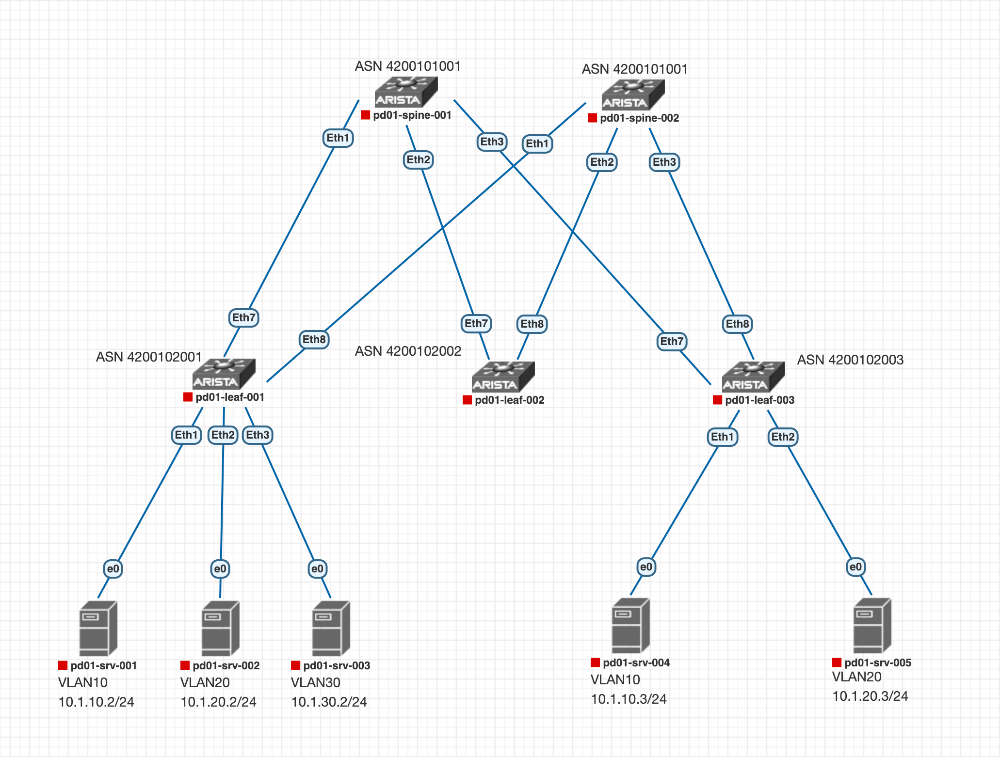

# **Настройка сервиса EVPN L3**

Будем работать на следующей топологии: <br>


Настройки eBGP в Underlay и BGP EVPN пиринга возьмем из [предыдущей работы](https://github.com/aledkrv/otus_cod_learning/tree/main/lesson_5_evpnl2).

На Leaf-001 добавим MAC-VRF для VLAN 10, 20 и 30
````
interface Vxlan1
   vxlan source-interface Loopback1
   vxlan vlan 10 vni 10010
   vxlan vlan 20 vni 10020
   vxlan vlan 30 vni 10030

router bgp 4200102001
 vlan 10
      rd 10.1.2.101:10010
      route-target both 1:10010
      redistribute learned
   !
   vlan 20
      rd 10.1.2.101:10020
      route-target both 1:10020
      redistribute learned
   !
   vlan 30
      rd 10.1.2.101:10030
      route-target both 1:10030
      redistribute learned
````
На Leaf-003 добавим MAC-VRF для VLAN 10 и 20
````
interface Vxlan1
   vxlan source-interface Loopback1
   vxlan vlan 10 vni 10010
   vxlan vlan 20 vni 10020

router bgp 4200102003
 vlan 10
      rd 10.1.2.103:10010
      route-target both 1:10010
      redistribute learned
   !
   vlan 20
      rd 10.1.2.103:10020
      route-target both 1:10020
      redistribute learned
````
Сейчас взаимодействие между хостами внутри подсети во VLAN 10 и VLAN 20 уже появилось, благодаря L2VPN. 

### Настроим L3VPN в модели Assymmetric IRB. 
Данная модель подразумевает маршрутизацию на ingress VTEP, а так же требует одинаковой конфигурации VLAN-VNI на всех VTEP.

На pd01-leaf-001 и pd01-leaf-003 создадим VRF OTUS, включим в нем маршрутизацию, а так же создадим интерфейсы шлюзов наших VLAN и назначим Virtual IP на них. Зададим MAC адрес виртуального роутера.
```` 
vrf instance OTUS
ip routing vrf OTUS
interface Vlan10
   vrf OTUS
   ip address virtual 10.1.10.1/24
!
interface Vlan20
   vrf OTUS
   ip address virtual 10.1.20.1/24
!
interface Vlan30
   vrf OTUS
   ip address virtual 10.1.30.1/24

ip virtual-router mac-address 00:00:22:22:33:33
````
В дампе можем увидеть как на коммутатор приходят bgp update route-type 2 сначала с MAC адресом, а затем с MAC-IP.
<image src=images/rt-2-l2.png  width="500"/><br>
<image src=images/rt-2-l3.png  width="500"/><br>

Проверяем связность между хостами. <br>
<details>
<summary> Хосты в пределах одного коммутатора в разных VLAN видят друг друга</summary>
<image src=images/srv1-ping-all.png width="500"/><br>
</details><br>
Хосты на разных коммутаторах в VLAN 10 и 20 видят друг друга, однако с pd01-srv-003(vlan30) доступны только хосты, подключенные к pd01-leaf-001. 
<image src=images/srv3-rping-fail.png width="500"/>

Это связано с тем, что модель Assymetric IRB требует наличия всех VLAN-VNI на всех VTEP, а на pd01-leaf-003 нет VLAN-VNI для VLAN ID 30.

#### Чтобы это исправить - донастроим L3VPN до модели Symmetric IRB

На pd01-leaf-001 и pd01-leaf-003 добавим vrf в overlay
````
pd01-leaf-001
interface Vxlan1
   vxlan vrf OTUS vni 65000
router bgp 4200102001
vrf OTUS
      rd 10.1.2.101:65000
      route-target import 1:65000
      route-target import evpn 1:65000
      route-target export evpn 1:65000

pd01-leaf-003
interface Vxlan1
   vxlan vrf OTUS vni 65000
router bgp 4200102003
vrf OTUS
      rd 10.1.2.103:65000
      route-target import 1:65000
      route-target import evpn 1:65000
      route-target export evpn 1:65000
`````

Проверяем что с pd01-srv-003 доступны хосты pd01-srv-004 и pd01-srv-005

<image src=images/srv3-rping-succ.png width="500"/><br>
Посмотрим на таблицу маршрутизации evpn, можно увидеть mac-ip наших хостов.<br>
<image src=images/show-bgp-evpn.png width="500"/><br>
Так же в arp таблице VRF видны маки, изученные через vxlan<br>
<image src=images/arp-vrf.png width="500"/><br>

Конфигурация всех устройств доступна по [ссылке](https://github.com/aledkrv/otus_cod_learning/tree/main/lesson_6_evpnl3/lab_evpn_l3_configs)


