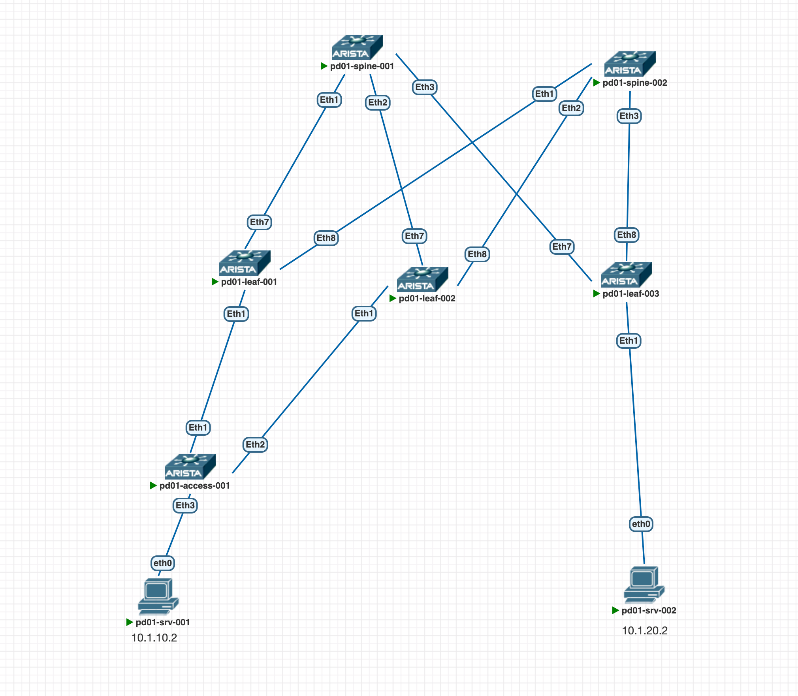
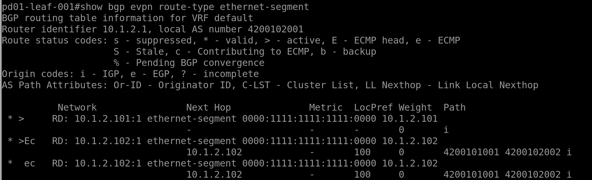
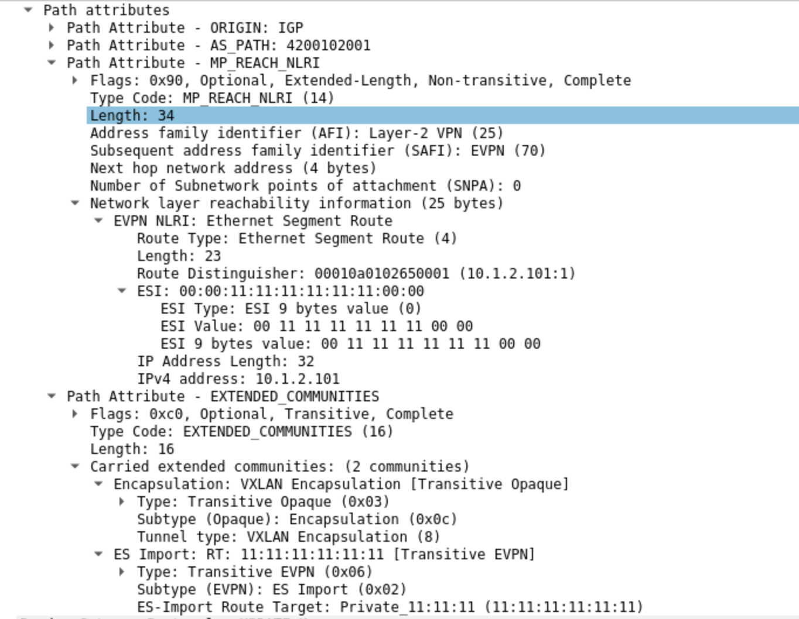
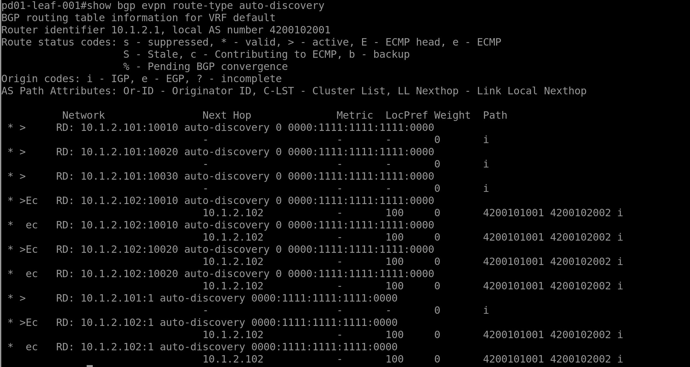
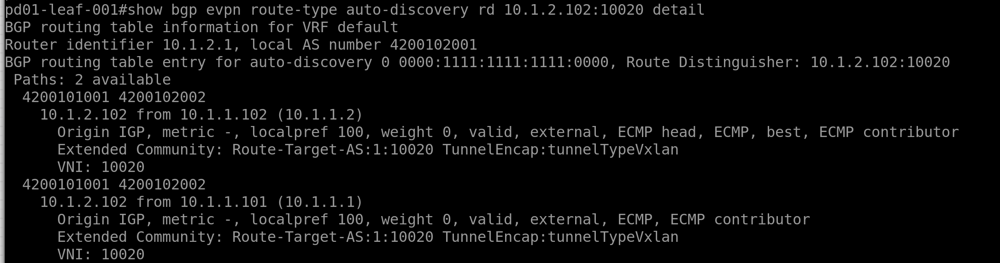

# **Настройка EVPN ESI LAG**

Будем работать на следующей топологии:   
  


В нашу топологию мы добавили коммутатор pd01-access-001. Он необходим для аггрегирования линков к leaf коммутаторам.  
Конфигурация его минимальна:

```
vlan 10,20,30
!
interface Port-Channel1
   switchport trunk allowed vlan 10,20,30
   switchport mode trunk
!
interface Ethernet1
   switchport trunk allowed vlan 10,20,30
   switchport mode trunk
   channel-group 1 mode active
!
interface Ethernet2
   switchport trunk allowed vlan 10,20,30
   switchport mode trunk
   channel-group 1 mode active
!
interface Ethernet3
   switchport access vlan 10
```

За основу возьмем конфигурации Spine и Leaf из [предыдущей работы](https://github.com/aledkrv/otus_cod_learning/tree/main/lesson_6_evpnl3).

Применение Multihoming позволяет решить следующие задачи:   
 

*   защита от петель
*   балансировка трафика
*   конвергенция  
     

Для решения данных задач используются route-type 1 и 4

*   Route-Type 1 - Ethernet Auto-Discovery route
*   Route-Type 4 - Ethernet Segment route

Настройка Port-Channel на pd01-leaf-001 и pd01-leaf-002 в сторону pd01-access-001. конфигурация Ethernet порта и Port-channel идентична на обеих устройствах

```
interface Ethernet1
   description pd01-access-001
   channel-group 1 mode active
interface Port-Channel1
   switchport trunk allowed vlan 10,20,30
   switchport mode trunk
   lacp system-id 1111.1111.1111
```

Указываем одинаковый lacp system-id, чтобы pd01-access-001 думал что обеими линками подключен к одному устройству.  
Port-Channel до pd01-access-001 поднялся:

```
Port-Channel1 is up, line protocol is up (connected)
  Hardware is Port-Channel, address is 506c.6102.9c01
```

Далее добавим Port-channel в ethernet-segment

```
interface Port-Channel1
evpn ethernet-segment
      identifier 0000:1111:1111:1111:0000
      route-target import 11:11:11:11:11:11
```

Видим что в evpn стали отправляться RT4 маршруты с идентификатором нашего ethernet-segment  
  
 

**Route-type 4**

*   Ethernet Segment route
*   Уникален для каждого EVI (EVPN instance)
*   Используется для обнаружения VTEP'ов, подключенных к одному ES (Ethernet Segment)
*   Используется для выбора DF (Designated Forwarder)
    *   DF отвечает за BUM трафик в сторону ES
    *   DF выбирается per EVI

Посмотрим как выбрался DF для EVI 10

```
pd01-leaf-001#show bgp evpn instance vlan 10
EVPN instance: VLAN 10
  Route distinguisher: 10.1.2.101:10010
  Route target import: Route-Target-AS:1:10010
  Route target export: Route-Target-AS:1:10010
  Service interface: VLAN-based
  Local IP address: 10.1.2.101
  Encapsulation type: VXLAN
  Local ethernet segment:
    ESI: 0000:1111:1111:1111:0000
      Interface: Port-Channel1
      Mode: all-active
      State: up
      ES-Import RT: 11:11:11:11:11:11
      Designated forwarder: 10.1.2.101
      Non-Designated forwarder: 10.1.2.102
```

```
pd01-leaf-002#show bgp evpn instance vlan 10
EVPN instance: VLAN 10
  Route distinguisher: 10.1.2.102:10010
  Route target import: Route-Target-AS:1:10010
  Route target export: Route-Target-AS:1:10010
  Service interface: VLAN-based
  Local IP address: 10.1.2.102
  Encapsulation type: VXLAN
  Local ethernet segment:
    ESI: 0000:1111:1111:1111:0000
      Interface: Port-Channel1
      Mode: all-active
      State: up
      ES-Import RT: 11:11:11:11:11:11
      Designated forwarder: 10.1.2.101
      Non-Designated forwarder: 10.1.2.102
```

В нашем случае DF это pd01-leaf-001

А так выглядит дамп пакета с route-type 4 маршрутом  
  
 

**Route-type 1**

*   Ethernet Auto Discovery
*   один общий маршрут для всех EVI (для конвергенции)
*   отдельный маршрут для каждого EVI (для балансировки)

После назначения на линк ESI, VTEP отправляет в фабрику update c route-type 1, в котором сообщает что подключен к этому ESI. Если же линк отключается, то он отправляет в фабрику withdraw с этим ES. Таким образм если за хостом было множество МАС адресов, достаточно одного route-type 1 с Withdraw, чтобы все VTEP'ы в фабрике, получившие этот update, удалили IP адрес VTEP'а, приславшего этот Withdraw из списка next-hop для этого ES. Таким образом достигается более эффективная конвергенция

Так же данный механизм позволяет VTEPам держать информацию о нескольких next-hop для одного и того же МАС адреса. Таким образом решается вопрос балансировки

Посмотрим на маршруты route-type 1 на pd01-leaf-001

show bgp evpn route-type auto-discovery  
  
Здесь мы видим как общие route-type 1, так и per EVI. Рассмотрим один из них еще подробнееshow bgp evpn route-type auto-discovery rd 10.1.2.102:10020 detail  
  
Видим что для данного маршрута доступны 2 пути, через pd01-spine-001 и pd01-spine-002

Чтобы окончательно убедиться что все работает - проверим связность между хостами выполнив ping от pd01-srv-002 к pd01-srv-001

ping result  
  
 

Связность есть.

Конфигурация устройств доступна [по ссылке](https://github.com/aledkrv/otus_cod_learning/tree/main/lesson_7_multihoming/lab_multihoming_configs)