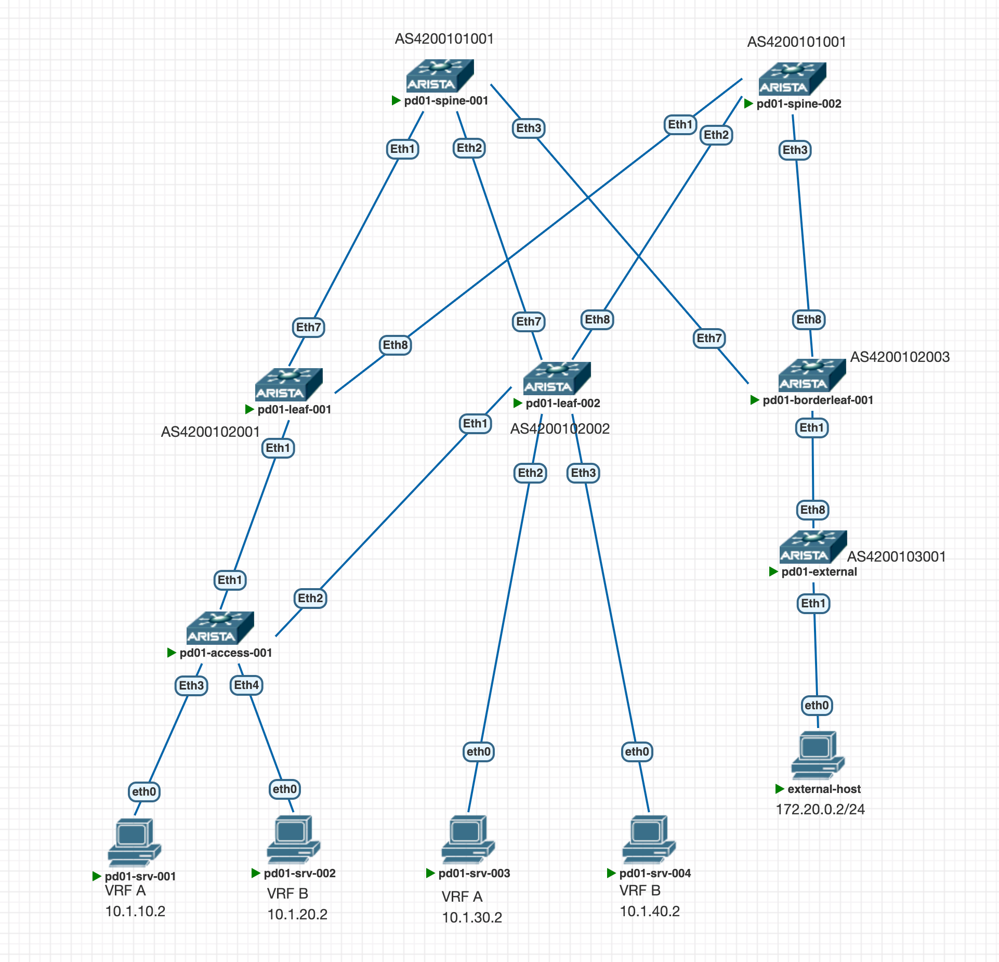

# **VxLAN Routing**

В данной работе мы создадим 2 независимых VRF в нашей VxLAN фабрике, а затем подключим фабрику к внешним сетям, и, с помощью данного подключения, настроим маршрутизацию между VRF.

Будем работать на следующей топологии: <br>


За основу будет взята сеть из предыдущей работы. Коммутатор pd01-access-001 подключен к лифам через ESI LAG.

Создадим VRF в которые будут включаться наши хосты.

VRF A
 * 10.1.10.0/24
 * 10.1.30.0/24

VRF B
 * 10.1.20.0/24
 * 10.1.40.0/24
  
Настроим виртуальные интерфейсы на leaf и добавим их в соответствующие VRF:
`````
vrf instance A
ip routing vrf A
vrf instance B
ip routing vrf B

interface Vlan10
   vrf A
      ip address virtual 10.1.10.1/24
!
interface Vlan20
   vrf B
      ip address virtual 10.1.20.1/24
!
interface Vlan30
   vrf A
      ip address virtual 10.1.30.1/24
interface vlan 40
 vrf B
   ip address virtual 10.1.40.1/24

`````
Эти настройки выполняются на всех Leaf, в том числе на borderleaf. Так как мы будем агрегировать передаваемые в external хостовые сети, это позволит нам анонсировать маршруты даже тогда, когда хосты не будут генерировать трафик и в vrf пропадут их arp записи.

#### Добавим наши VRF в VxLAN ####

Настройка на всех leaf идентична, отличается только BGP AS
````
router bgp 420010200X
   vlan 10
      rd 10.1.2.101:10010
      route-target both 1:10010
      redistribute learned
   !
   vlan 20
      rd 10.1.2.101:10020
      route-target both 1:10020
      redistribute learned
   !
   vlan 30
      rd 10.1.2.101:10030
      route-target both 1:10030
      redistribute learned
   !
   vlan 40
      rd 10.1.2.101:10040
      route-target both 1:10040
      redistribute learned
   vrf A
      rd 10.1.2.101:65000
      route-target import evpn 65000:100
      route-target export evpn 65000:100
   !
   vrf B
      rd 10.1.2.101:65001
      route-target import evpn 65001:200
      route-target export evpn 65001:200
interface Vxlan1
   vxlan source-interface Loopback1
   vxlan udp-port 4789
   vxlan vlan 10 vni 10010
   vxlan vlan 20 vni 10020
   vxlan vlan 30 vni 10030
   vxlan vlan 40 vni 10040
   vxlan vrf A vni 65000
   vxlan vrf B vni 65001
   ````
#### Переходим к настройке borderleaf ####

Наш borderleaf подключен к маршрутизатору, через который в VXLAN фабрику будут подключаться внешние клиенты.

Настроим 2 сабинтерфейса для организации связности каждого из VRF
`````
interface Ethernet1
   description pd01-external
   no switchport
!
interface Ethernet1.100
   encapsulation dot1q vlan 100
   vrf A
   ip address 172.16.0.1/30
!
interface Ethernet1.200
   encapsulation dot1q vlan 200
   vrf B
   ip address 172.16.0.5/30
!
`````
Далее настроим BGP пиринг с pd01-external в каждом VRF
`````
router bgp 4200102003
   vrf A
      neighbor 172.16.0.2 remote-as 4200103001
      neighbor 172.16.0.2 local-as 4200102100 no-prepend replace-as
      neighbor 172.16.0.2 route-map SINGLE_AS_IN_4200102100 in
      neighbor 172.16.0.2 route-map SINGLE_AS_OUT out
      aggregate-address 10.1.10.0/24 summary-only
      aggregate-address 10.1.30.0/24 summary-only
   !
   vrf B
      neighbor 172.16.0.6 remote-as 4200103001
      neighbor 172.16.0.6 local-as 4200102200 no-prepend replace-as
      neighbor 172.16.0.6 route-map SINGLE_AS_IN_4200102200 in
      neighbor 172.16.0.6 route-map SINGLE_AS_OUT out
      aggregate-address 10.1.20.0/24 summary-only
      aggregate-address 10.1.40.0/24 summary-only
`````
Чтобы pd01-external думал что он подключен к 2м разным AS будем использовать подмену local-as. Конструкция no-prepend replace-as должна заменять as-path на номер локальной AS, однако в лабораторных условиях она не сработала, что привело к тому, что spine получал маршрут, который содержал его собственный ASN и отбрасывал его. Был применен "обходной манёвр"
`````
route-map SINGLE_AS_IN_4200102100 permit 10
   set as-path match all replacement 4200102100
!
route-map SINGLE_AS_IN_4200102200 permit 10
   set as-path match all replacement 4200102200
!
route-map SINGLE_AS_OUT permit 10
   set as-path match all replacement none
router bgp 4200102003
vrf A
neighbor 172.16.0.2 remote-as 4200103001
      neighbor 172.16.0.2 local-as 4200102100 no-prepend replace-as
      neighbor 172.16.0.2 route-map SINGLE_AS_IN_4200102100 in
      neighbor 172.16.0.2 route-map SINGLE_AS_OUT out
 vrf B
      neighbor 172.16.0.6 remote-as 4200103001
      neighbor 172.16.0.6 local-as 4200102200 no-prepend replace-as
      neighbor 172.16.0.6 route-map SINGLE_AS_IN_4200102200 in
      neighbor 172.16.0.6 route-map SINGLE_AS_OUT out

`````
Данная route-map замещает as-path у маршрутов, полученных от пира.

Так же включаем агрегацию маршрутов, чтобы сократить количество записей в таблице маршрутизации.
#### Далее настроим pd01-external router ####

Настройка pd01-external достаточно простая.  
Настраиваем пиринговые адреса на сабинтерфейсах, поднимаем лупбек с адресом 8.8.8.8, которые будем использовать для проверки связности. Так же был настроен хост во "внешней" сети (VPC external-host) так же для проверки связности.
`````
vlan 100
   name VRF_A
!
vlan 200
   name VRF_B
!
interface Ethernet1
   no switchport
!
interface Ethernet8
   switchport mode trunk
   no switchport
!
interface Ethernet8.100
   encapsulation dot1q vlan 100
   ip address 172.16.0.2/30
!
interface Ethernet8.200
   encapsulation dot1q vlan 200
   ip address 172.16.0.6/30
!
interface Loopback0
   ip address 10.1.3.1/32
!
interface Loopback1
   ip address 8.8.8.8/32
!
ip routing
!
ip prefix-list NET-CONNECTED
   seq 10 permit 8.8.8.8/32
   seq 20 permit 172.20.0.0/24
!
route-map RM_REDIS_CONN permit 10
   match ip address prefix-list NET-CONNECTED
   set origin igp
!
router bgp 4200103001
   router-id 10.1.3.1
   neighbor 172.16.0.1 remote-as 4200102100
   neighbor 172.16.0.5 remote-as 4200102200
   redistribute connected route-map RM_REDIS_CONN

``````
#### Проверка ####
Проверим что bgp соседство поднялось и мы получаем маршруты.
<image src=images/ext-ip-r.png width="500"/><br>
Маршруты обо всех сетях получены.

Проверим что с хостов доступны внешние сети, а так же есть связность между хостами в разных VRF

<image src=images/s1-ping-all.png width="500"/><br>

Как видим, связность есть как до внешней сети, так и до хостов в сетях другого VRF(в нашем случае VRF B)

Посмотрим на Route-type 5 маршруты, которые передает наш borderleaf на спайны.
<image src=images/bl-adve-sp.png width="500"/><br>
В выводе команды видно, что для каждой сети из VRF есть 2 маршрута, у одного AS-Path содержит 3 AS(это маршруты, полученные от другого spine, при получении такого маршрута spine его отбросит, т.к. AS-Path содержит собственную AS spine(4200101001)). Второй же маршрут содержит 2 AS и начинается с 4200102Х00, именно этот маршрут получен от pd01-external и его AS-Path с помощью route-map заменен на AS VRF pd01-borderleaf.

Так выглядят Route-type 5 маршруты на pd01-leaf-001, и таблицы маршрутизации для VRF А и B 
<details>
<summary>show bgp evpn route-type ip-prefix ipv4</summary>
<image src=images/lf-rt5.png width="500"/><br>
</details><br> 
<details>
<summary>show ip route vrf </summary>
<image src=images/lf-vrf-rt.png width="500"/><br>
</details><br> 

В дампе мы можем увидеть BGP Update с Route-type 5 
<image src=images/rt5-packet.png width="500"/>

Конфигурация устройств доступна [по ссылке](https://github.com/aledkrv/otus_cod_learning/tree/main/lesson_8_RT5/lab_RT5_configs)